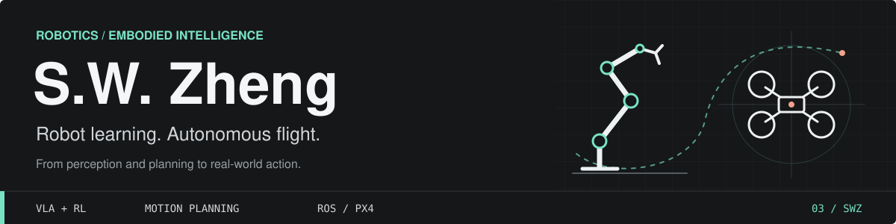

  

  <strong>Robot Learning · Autonomous Flight · Perception &amp; Control</strong> 
  FeisiLab · Changsha, China

  <a href="https://github.com/Zhengsw03?tab=repositories">Repositories</a> ·
  <a href="https://github.com/Zhengsw03/RL-Token-Pi05-open">Robot Learning</a> ·
  <a href="mailto:siweizheng03@163.com">Email</a>

## About

My interests span **robot learning, motion planning, and control**. I work on practical robotics pipelines, from simulation workspaces to learning and deployment on real hardware.

## Honors

- **RMUA National First Prize**
- **RM AWARD Candidate**
- **RM AWARD Algorithm Nomination Award**

## Robot Learning

### [RL-Token-Pi05-open](https://github.com/Zhengsw03/RL-Token-Pi05-open)

An end-to-end RL Token pipeline for the **SO-101** arm: demonstration collection, **π0.5** fine-tuning, critical-phase detection, online reinforcement learning on real hardware, and deployment.

   
  VLA baseline (left) / RL Token policy (right) · SO-101 real-hardware demo

**Python · PyTorch · LeRobot · Vision-Language-Action · Online RL**

## Aerial Robotics

### [RflyArena](https://github.com/RflySim/RflyArena)

A UAV controller testing and deployment framework spanning **SITL simulation, HITL validation, and real-world flight**.

  Circle (left) · Figure-8 (right)

#### NMPC

  
  

#### PID/SO(3)

  
  

#### RL

  
  

### Workspaces

| Project | Focus |
| :--- | :--- |
| **[Rflysim_fastlio_ws](https://github.com/Zhengsw03/Rflysim_fastlio_ws)** | FAST-LIO and LiDAR localization workspace for RflySim. `C++` · `ROS` · `Livox` · `State Estimation` |
| **[Rflysim_fuel_ws](https://github.com/Zhengsw03/Rflysim_fuel_ws)** | UAV planning and simulation workspace with LiDAR and depth-camera launch workflows. `ROS` · `RflySim` · `Planning` · `Simulation` |

## Toolkit

  

| Area | Interests |
| :--- | :--- |
| **Robot Learning** | VLA models · Reinforcement learning · Robot manipulation |
| **Planning & Control** | Motion planning · MPC / NMPC · Trajectory tracking |
| **Perception & Systems** | LiDAR localization · ROS / ROS 2 · PX4 · Simulation |

<strong>Reading &amp; Exploration</strong>

These upstream open-source projects are part of my reading and learning, not my original work.

- **Navigation:** [NeuPAN](https://github.com/Zhengsw03/NeuPAN) · [NavRL](https://github.com/Zhengsw03/NavRL) · [ViPlanner](https://github.com/Zhengsw03/viplanner)
- **Control:** [Intent-MPC](https://github.com/Zhengsw03/Intent-MPC) · [Avoid-MPC](https://github.com/Zhengsw03/Avoid-MPC) · [PX4 MPC](https://github.com/Zhengsw03/px4-mpc)
- **Learning to Fly:** [SimpleFlight](https://github.com/Zhengsw03/SimpleFlight) · [Isaac Lab Hover](https://github.com/Zhengsw03/RL_AirDrone_hover_IsaacLab)

---

  <strong>Perceive. Plan. Learn. Act.</strong> 
  <a href="https://github.com/Zhengsw03?tab=repositories">More experiments</a> · <a href="mailto:siweizheng03@163.com">siweizheng03@163.com</a>

